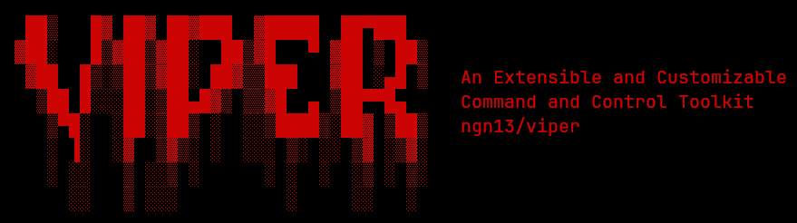

 

      

---

 

### 🧐 What is Viper?
Viper is an extensible and customizable command and control toolkit that you can use to 
create trojan, backdoor, stealer, ransomware and all the other kinds of malware

 

### 🤔 How do I use it?
Viper provides the following tools that you can use to develop your own malware (agent) and an operator client:
- [A command and control (C2) web server](https://github.com/ngn13/viper/tree/main/server)
- [A python API libary for the C2 server](https://github.com/ngn13/viper/tree/main/lib)

 

### ✨ It is free!
Viper is licensed under GPLv2, it's completely free and open source, so feel free to play around with it,
And if you end up building a cool project using viper, please let me know! Maybe i'll add it to this README.
Have fun!

 
